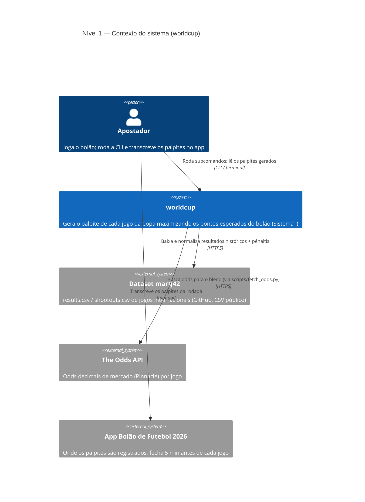
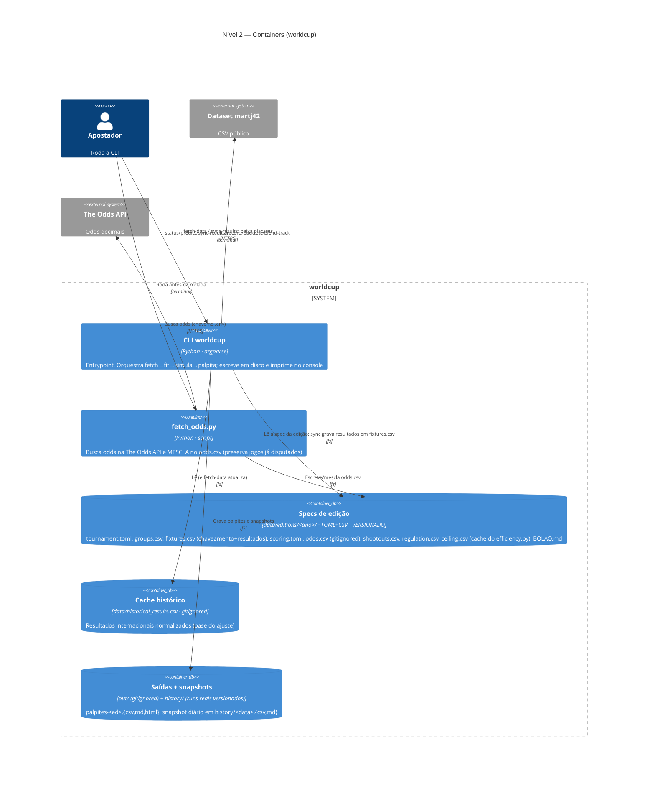
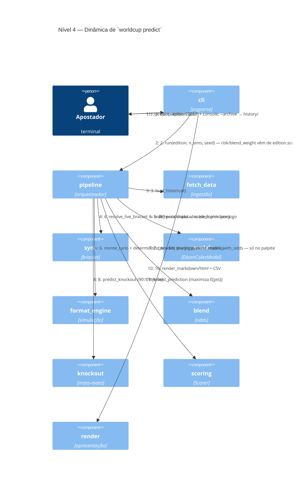

# C4 model — worldcup

Visão de arquitetura no modelo [C4](https://c4model.com)
(Context → Container → Component → Dynamic). Diagramas em **Mermaid**
(renderizam no GitHub e em editores compatíveis).
Derivado da implementação real em `src/worldcup/` — o grafo de componentes reflete os imports
do pacote, não uma idealização.
Para a **metodologia/matemática** ver [`SPEC.md`](SPEC.md); para o **guia de módulos em prosa**,
a seção *Arquitetura* do [`AGENTS.md`](../AGENTS.md).

> Convenção: o `worldcup` é um app **CLI de um processo só**; não há serviços em rede nem banco.
> Os "containers" C4 aqui são os **executáveis** (CLI e o script de odds) e os **stores em disco**
> (specs de edição, cache histórico, saídas). As fronteiras de versionamento
> (versionado vs `.gitignore`) estão anotadas. `scripts/fetch_odds.py` aparece por **alimentar**
> o fluxo (odds → blend); `scripts/efficiency.py` é deliberadamente **omitido** — é análise
> *read-only* a jusante (lê snapshots e reconstrói palpites as-of), fora do fluxo de previsão.

---

## Nível 1 — Contexto do sistema

Quem usa e com quais sistemas externos o `worldcup` conversa.

O `worldcup` **não integra** com o app do bolão: o humano é a ponte
(lê os palpites, registra no app). O blend com odds é opcional e degrada graciosamente
(sem `odds.csv` ⇒ só o modelo).

---

## Nível 2 — Containers

Executáveis e stores em disco dentro da fronteira do sistema.

---

## Nível 3 — Componentes (dentro da CLI)

Os módulos de `src/worldcup/` e suas dependências **reais** (grafo de imports). Camadas:
**orquestração** (cli, pipeline), **domínio** (model, scoring, knockout, blend, format_engine),
**dados/suporte** (edition, fetch_data, teams, sync, backtest, render, status). `scoring` e
`teams` são as folhas reutilizadas por quase todos.

```mermaid
C4Component
    title Nível 3 — Componentes (pacote src/worldcup)

    Person(bettor, "Apostador", "CLI")
    System_Ext(dataset, "Dataset martj42", "CSV")

    Container_Boundary(cliC, "CLI worldcup") {
        Component(cli, "cli", "argparse", "Entrypoint; parsing, I/O em disco (save/archive), console")
        Component(pipeline, "pipeline", "orquestrador", "fetch→fit→realimenta→simula→palpita; devolve PredictionRun")

        Component(model, "model", "DixonColesModel", "Ajuste ponderado (decaimento+torneio+mando); score_matrix")
        Component(scoring, "scoring", "Scorer", "Pontos do Sistema I; best_prediction (maximiza E[pts])")
        Component(knockout, "knockout", "predict_knockout", "3 camadas: 90' / prorrogação / pênaltis + quem avança")
        Component(blend, "blend", "odds (ENG-19)", "devig → log_opinion_pool → rescale_matrix")
        Component(fmt, "format_engine", "simulação", "Standings, Monte Carlo, chaveamento determinístico")

        Component(edition, "edition", "Pydantic v2", "load_edition / Edition.as_of; valida a spec")
        Component(fetch, "fetch_data", "ingestão", "Baixa results/shootouts; normaliza histórico")
        Component(teams, "teams", "nomes", "Canônico (inglês) ↔ exibição (PT)")
        Component(sync, "sync", "bracket", "Resolve o chaveamento só com resultados reais; preenche fixtures")
        Component(backtest, "backtest", "validação", "Backtest + blend-track (Brier) + monitor de empates")
        Component(render, "render", "apresentação", "render_markdown / render_html + CSV_COLUMNS (puro)")
        Component(status, "status", "briefing", "build_status / format_status: foto read-only do estado (ENG-31)")
    }

    Rel(bettor, cli, "Subcomandos")
    Rel(fetch, dataset, "Baixa CSVs", "HTTPS")

    Rel(cli, edition, "Carrega a spec")
    Rel(cli, pipeline, "run()")
    Rel(cli, render, "Gera MD/HTML/CSV")
    Rel(cli, fetch, "fetch-data")
    Rel(cli, sync, "sync-results (lazy)")
    Rel(cli, backtest, "backtest / blend-track (lazy)")
    Rel(cli, status, "status / ws (lazy)")

    Rel(pipeline, model, "fit + score_matrix")
    Rel(pipeline, blend, "blenda matriz×odds")
    Rel(pipeline, fmt, "monte_carlo / bracket")
    Rel(pipeline, knockout, "palpite do mata-mata")
    Rel(pipeline, scoring, "best_prediction")
    Rel(pipeline, fetch, "load_historical")
    Rel(pipeline, sync, "resolve_live_bracket (lazy) — realimenta KO + ingestion_gaps")

    Rel(sync, edition, "load_edition")
    Rel(sync, fetch, "download")
    Rel(sync, fmt, "group_standings")
    Rel(backtest, model, "fit as-of")
    Rel(backtest, scoring, "pontua")
    Rel(backtest, fmt, "MatrixCache")
    Rel(backtest, knockout, "predict_knockout")

    Rel(blend, scoring, "outcome_probs")
    Rel(fmt, scoring, "outcome_probs")
    Rel(knockout, scoring, "outcome_probs")
    Rel(model, teams, "canonical")
    Rel(fetch, teams, "canonical")
    Rel(render, teams, "display")
```

Arestas omitidas para legibilidade: as da folha `teams`, usada amplamente (`pipeline→teams`,
`sync→teams`, `backtest→teams`, `cli→teams`, `edition→teams`, `status→teams`), mais
`backtest→edition`, `backtest→fetch` e as arestas lazy exclusivas do `blend-track`
(`backtest→pipeline`, `backtest→blend`). `scoring` não importa nenhum outro módulo do pacote
(folha de baixo nível); `edition` só importa `teams`.

---

## Nível 4 — Dinâmica: o fluxo de `predict`

Sequência em runtime de `worldcup predict --edition 2026` (o caminho mais quente).

O ajuste (5) e a simulação de campeão/avanço (6) rodam **uma vez**; a geração do palpite (7–9)
roda **por jogo** (grupos via `score_matrix`; mata-mata via `knockout`), e o blend (7) só entra
na matriz do palpite — a simulação (6) segue com o modelo puro. Sem `odds.csv` ou
`blend_weight=0`, o passo 7 é pulado e a matriz do modelo segue intacta. `sync-results` e
`record` percorrem o mesmo pipeline **depois** de gravar resultados em `fixtures.csv`
(realimentação: jogos disputados saem `FINAL`, só os restantes recebem palpite).
