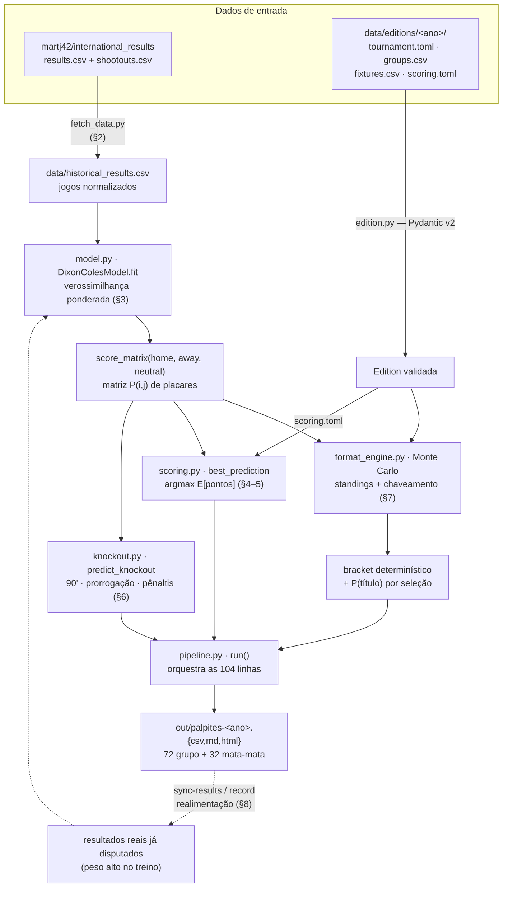

# SPEC — Especificação técnica e metodologia

Documento de **metodologia e decisões** do gerador de palpites (`worldcup`). Cobre a matemática do
modelo, a fórmula de pontuação, a estratégia de escolha do palpite, a simulação e os contratos de
dados — com derivações e exemplos numéricos. Para *como rodar*, veja `README.md`; para *onde está
cada coisa*, veja `AGENTS.md`.

> Notação: `λ` = gols esperados do mandante, `μ` = gols esperados do visitante, `p` = probabilidade.
> Todos os exemplos numéricos são conferíveis à mão e refletem a implementação em `src/worldcup/`.

---

## Visão geral do fluxo

Do dado bruto ao palpite pronto para copiar no app. Cada caixa é um módulo de `src/worldcup/`;
as seções entre parênteses detalham a etapa.



**Realimentação (linha tracejada):** durante a Copa, `sync-results` baixa os placares reais e os
reinjeta no treino (peso alto) e no chaveamento (fixa o que já foi decidido); só os jogos que faltam
são repalpitados. Ver §8.

---

## 1. Objetivo e premissas

Gerar, para cada jogo de uma Copa, o palpite que **maximiza os pontos esperados** no bolão do app
*Bolão de Futebol 2026*, sob o **Sistema I** (probabilístico): os pontos de um jogo crescem com a
**raridade** do resultado — acertar a zebra vale muito mais que cravar o favorito óbvio.

Premissas de projeto:
- **Agnóstico à edição**: formato, jogos e pontuação vivem em dados (`data/editions/<ano>/`).
- **Puramente estatístico**: sem LLM em runtime; só resultados históricos.
- **Reprodutível**: simulações com semente fixa; ajuste determinístico.

---

## 2. Dados

**Fonte**: dataset público `martj42/international_results` (`results.csv` + `shootouts.csv`),
resultados de seleções desde 1872, atualizado poucas horas após cada jogo. Escolhido em vez da
página da FIFA porque esta é renderizada em JavaScript (raspagem frágil); o CSV é estável,
parseável e mantém **histórico e resultados na mesma origem**.

**Normalização** (`fetch_data.py`):
- corte temporal: jogos a partir de `2006-01-01` (configurável);
- só jogos disputados (descarta linhas com placar `NA` — inclusive os jogos futuros de 2026);
- nomes de seleção canonizados para o padrão do dataset (inglês), via `teams.canonical`;
- flag `neutral` booleana (define mando — ver §3.1).

A fonte já traz os 72 jogos de grupo de 2026 (com data, sede e `neutral`); o `fixtures.csv` é
derivado dela seguindo a **escala oficial** da FIFA — cuja ordem `home`/`away` pode listar o
anfitrião como *visitante* num jogo no estádio dele (§3.1). Por isso a ordem passa por conferência,
não é cópia crua. Os jogos de mata-mata de 2026 ainda não têm seleções, então seu chaveamento é
codificado por slots (§7.2).

---

## 3. Modelo Dixon–Coles

### 3.1 Formulação

Para um jogo entre mandante `h` e visitante `a`, os gols `(X, Y)` seguem Poisson com médias

```
λ = exp( base + ataque[h] − defesa[a] + γ · mando_h )
μ = exp( base + ataque[a] − defesa[h] + γ · mando_a )
```

onde `γ` é a vantagem de mando e `base` é o intercepto (nível médio de gols em escala log).

O mando vale `1` para o lado que joga em casa e `0` para o outro; em campo neutro ambos são `0`.
Normalmente quem joga em casa é o mandante (`mando_h = 1`). **Exceção** — a escala oficial da FIFA
às vezes lista o anfitrião como *visitante* num jogo disputado no estádio dele (ex.: Copa 2026,
*Suíça × Canadá* em Vancouver). Nesse caso a vantagem vai para o visitante (`mando_a = 1`): a regra
é
"o mando é de quem está em `tournament.toml::hosts`", não da coluna `home`. No código isso é o
parâmetro `host_away` de `score_matrix`, derivado em um único lugar (`MatrixCache._host_away`). No
**ajuste histórico** `host_away` é sempre `False` (o `neutral` da fonte já codifica o mando); o
**backtest** roteia pela mesma `MatrixCache`, com os anfitriões da Copa-alvo (`_WORLD_CUP_HOSTS`),
para pontuar os jogos do país-sede como a produção faria (§9.1).

O modelo **Poisson independente** daria `P(X=i, Y=j) = Pois(i;λ)·Pois(j;μ)`. Dixon & Coles (1997)
mostraram que placares baixos têm **dependência** (empates 0–0/1–1 mais frequentes que o produto
sugere). Corrigem com um fator `τ` aplicado às quatro células baixas:

```
τ(0,0) = 1 − λ·μ·ρ      τ(0,1) = 1 + λ·ρ
τ(1,0) = 1 + μ·ρ        τ(1,1) = 1 − ρ
τ(i,j) = 1              para os demais
```

A probabilidade (não normalizada) de um placar é então

```
P̃(i,j) = τ(i,j; λ, μ, ρ) · Pois(i;λ) · Pois(j;μ)
```

e a matriz é normalizada (§3.4) para somar 1 sobre a grade `0..10` (`FitConfig.max_goals`).

### 3.2 Verossimilhança ponderada

Cada jogo `k` contribui com a log-verossimilhança (constantes de fatorial omitidas, pois não afetam
o ótimo):

```
ℓ_k = ln τ(i_k, j_k) + [ i_k·ln λ_k − λ_k ] + [ j_k·ln μ_k − μ_k ]
```

O objetivo é a soma **ponderada** menos uma regularização (ridge):

```
minimizar   − Σ_k  w_k · ℓ_k   +   ridge · ( Σ ataque² + Σ defesa² )
```

com peso `w_k = decaimento_k · torneio_k · multiplicador_k`:

- **Decaimento temporal**: `decaimento = 0.5^(idade_anos / meia_vida)`, meia-vida padrão **2,0
  anos**
  (tunada via backtest leave-one-World-Cup-out — ver `docs/BACKLOG.md` ENG-17).
  Um jogo de 2 anos atrás pesa metade; de 4 anos, um quarto.
- **Importância do torneio**: Copa = 1,0; continentais 0,8–0,85; eliminatórias 0,8; UEFA Nations
  League 0,75; Gold Cup e torneios não listados 0,70; amistoso = 0,5 (tabela canônica em
  `model._TOURNAMENT_WEIGHTS`/`_DEFAULT_TOURNAMENT_WEIGHT`)
  (`model.tournament_weight`).
- **Multiplicador** (realimentação): jogos já disputados da própria Copa entram com peso extra
  (`CURRENT_EDITION_BOOST = 6.0`) para reajustar as forças à forma real no torneio.

A **regularização** funciona como **prior fraco**: puxa ataque/defesa para 0 (média da liga). Para
seleções com poucos jogos isso evita estimativas absurdas (regressão à média) — o efeito dos
estreantes.

### 3.3 Identificabilidade

`λ` depende de `ataque[h] − defesa[a]`, invariante sob `ataque → ataque + c`, `defesa → defesa + c`.
O ridge ancora `c` (penaliza valores grandes); pós-otimização **centramos** `ataque` e `defesa` em
média zero e **absorvemos o deslocamento no `base`** (somando a média do ataque e subtraindo a da
defesa), preservando `base + ataque[h] − defesa[a]`. Também filtramos seleções não-FIFA (CONIFA,
ilhas) que
jogam circuitos isolados e distorceriam o ajuste: mantém-se só quem disputa competições oficiais
(`peso_torneio ≥ 0.75` ou eliminatórias) com no mínimo `min_matches` jogos.

### 3.4 Exemplo numérico — matriz de placares

Sejam `λ = 1.8`, `μ = 0.8`, `ρ = −0.05`. As Poisson:

```
Pois(0;1.8)=0.1653  Pois(1;1.8)=0.2975  Pois(2;1.8)=0.2678
Pois(0;0.8)=0.4493  Pois(1;0.8)=0.3595  Pois(2;0.8)=0.1438
```

Algumas células (produto × τ):

```
P̃(1,0) = 0.2975·0.4493 · (1 + 0.8·(−0.05)=0.96)  = 0.13369·0.96 = 0.12834
P̃(0,0) = 0.1653·0.4493 · (1 − 1.8·0.8·(−0.05)=1.072) = 0.07428·1.072 = 0.07963
P̃(1,1) = 0.2975·0.3595 · (1 − (−0.05)=1.05)       = 0.10696·1.05 = 0.11231
P̃(0,1) = 0.1653·0.3595 · (1 + 1.8·(−0.05)=0.91)    = 0.05943·0.91 = 0.05408
```

Repetindo para toda a grade `0..10` e normalizando obtém-se a matriz `P`. Daí as probabilidades de
resultado:

```
P(mandante) = Σ_{i>j} P(i,j)   P(empate) = Σ_i P(i,i)   P(visitante) = Σ_{i<j} P(i,j)
```

(`scoring.outcome_probs_from_matrix` faz isso via `tril/trace/triu`.)

### 3.5 Blend com odds de mercado (opcional, `blend.py`, ENG-19)

O modelo é estatístico e cego a escalações, lesões, suspensões e motivação — informação que as
**odds de fechamento** de uma casa de apostas incorporam e que as torna um preditor público bem
calibrado. Quando há `odds.csv` para um jogo e `blend_weight = w > 0`, a matriz do modelo é ajustada
em três passos puros antes de virar palpite:

1. **Des-vig** (`devig`): odds decimais `o_k` → probabilidade implícita `1/o_k`, normalizada pela
   soma (a soma > 1 é a margem/overround da casa). Des-vig **proporcional**, o baseline padrão.
2. **Pool logarítmico** (`log_opinion_pool`): combina as triplas do modelo `m_k` e do mercado `q_k`
   por média geométrica ponderada, `p_k ∝ m_k^{1−w} · q_k^{w}`, renormalizada. `w=0` ⇒ só modelo;
   `w=1` ⇒ só mercado. Forma canônica de fundir opiniões probabilísticas (afia a massa quando as
   fontes concordam).
3. **Reescala da matriz** (`rescale_matrix`): multiplica cada célula pelo fator `p_classe-alvo /
   massa-atual-da-classe` (mandante = abaixo da diagonal, empate = diagonal, visitante = acima).
   Bate o 1×2-alvo **preservando** a distribuição condicional dos placares dentro de cada classe e a
   massa total — assim `best_prediction` (§5) e os bônus de placar exato seguem coerentes.

**Totals — ancorar também a taxa de gols (ENG-35).** O rescale de 1×2 preserva a forma condicional,
ou seja: os **gols esperados** — onde vivem o exato (+5) e o "gols do vencedor" (+3) do Sistema I —
ficavam 100% modelo. Com o mercado de **over/under** (colunas opcionais `total_line,over,under` do
mesmo `odds.csv`), o blend também corrige a taxa total:

4. **Des-vig do par** (`devig_pair`): over/under → probabilidades sem margem (2 vias). Linhas
   inteiras (push) e quarter-lines são tratadas como o limiar contínuo mais próximo (aproximação).
5. **λ implícito** (`implied_total_rate`): inverte `P(Poisson(λ) > linha) = p_over` por bissecção —
   o λ-total que o mercado está precificando na linha.
6. **Pool de taxas**: o pool logarítmico de duas Poissons é **exatamente** Poisson com
   `λ* = λ_modelo^{1−w} · λ_mercado^{w}` (média geométrica — mesma família do pool de 1×2).
7. **Tilting exponencial** (`tilt_matrix_to_total`): multiplica a célula `(i,j)` por `c^{i+j}`, com
   `c` resolvido para `E[gols totais] = λ*`. Num produto de Poissons isso equivale a escalar as duas
   taxas por `c` — preserva a razão mandante/visitante e a correlação DC; só a taxa total muda.
   Como tilt e rescale de 1×2 interagem, os passos 7 e 3 são **iterados** (3×), terminando no
   rescale: o 1×2 fica exato e o total converge dentro de tolerância. Sem totals para o jogo ⇒
   caminho antigo (passos 1–3) intacto.

Aplicado em `pipeline.run` só na geração do palpite dos jogos com odds — **fase de grupos e
mata-mata
já definido pelo bracket real** (`scripts/fetch_odds.py` resolve os confrontos de KO via
`sync.resolve_live_bracket` para casar as odds com os times resolvidos, ENG-28); a simulação de
campeão/avanço (§7) segue só com o modelo (odds em geral só existem para a rodada iminente). Sem
odds ou `w=0` ⇒
matriz intacta (degradação graciosa). **Calibração de `w`:** o LOO-CV histórico multi-Copa é
inviável
(não há odds de seleção 2010–2018 grátis/legais), então adota-se um **prior de princípio** `w≈0,6`
(odds de fechamento são quase-otimamente calibradas) e valida-se **prospectivamente** na própria
Copa
2026 — `backtest.prospective_blend_report` compara o Brier multiclasse do blend vs. o do modelo-puro
(as-of) nos jogos já disputados com odds (CLI `blend-track`); com totals registrados, o mesmo
comando também acompanha o **Brier binário do over/under** (modelo vs. blend). Ver ENG-19/ENG-35 no
backlog.

---

## 4. Pontuação (Sistema I)

Valores oficiais do app (confirmados no print de regras do grupo):

| Componente | Pontos |
|---|---|
| **Base** (por acertar o resultado 1×2) | **1 a 13**, varia com a probabilidade |
| Placar exato | +5 |
| Placar do vencedor (gols do vencedor) | +3 |
| Diferença de gols (saldo) | +2 |
| Gols do perdedor | +1 |
| Goleada (margem ≥ 3) | +1 |
| Prorrogação (mata-mata) | +3 |
| Pênaltis (mata-mata) | +3 |

Só contam se o **resultado (1×2) estiver certo** (errou o lado → 0). Os quatro níveis de acerto de
placar — **exato (+5) > gols do vencedor (+3) > saldo (+2) > gols do perdedor (+1)** — são
**hierárquicos, não cumulativos**: o app concede **apenas o maior nível atingido**, não a soma. Os
três níveis "decididos" são mutuamente exclusivos com o exato (acertar dois ⇒ é o exato). A
**goleada
(+1)** é um extra que empilha. (Confirmado nas telas "Pontos por Jogo" do app: Curaçao 0×2 cravado =
base(2)+5 = **7**, não base+11 — ver §4.3.)

### 4.1 Pontos base (régua fiel do app)

A base traduz "varia com a probabilidade, 1 a 13" como função da probabilidade `p` do resultado que
de fato aconteceu. A forma é **logarítmica**, calibrada ao **Simulador de Pontos do app**:

```
base(p) = clip( round( 1 + a · log10(1/p) ) , base_min=1 , base_max=13 ),   a ≈ 7.55
```

Essa é a régua **fiel do app** e **não depende de `risk`** — o risco mora na *escolha* do palpite
(§5), não na pontuação. Pontos observados no Simulador (que fixaram a calibração) e o teto:

| p | base (app) | base(p) do modelo |
|---|---|---|
| 0.80 | 2 | 2 |
| 0.50 | 3 | 3 |
| 0.45 | 3 | 4 ⚠️ |
| 0.20 | — | 6 |
| 0.15 | 7 | 7 |
| 0.10 | 9 | 9 |
| 0.05 | 11 | 11 |
| ≤ ~0.026 | 13 (teto) | 13 |

> Nota: a forma `(1/p)^γ` antiga **não** reproduzia o app (em `p=0.5` dava 2, o app dá 3); a
calibração
> log-linear acima ajusta os pontos observados dentro de ±0.5. Coeficiente em
`scoring.toml::base_log_coeff`;
> refinar com mais pontos do Simulador se necessário. (Backlog ENG-14.) Pontos do Simulador colhidos
em
> 26/06/2026 mostram que **nenhuma** curva log+arredondamento passa por `0.45→3` **e** `0.10→9` ao
mesmo
> tempo (o app usa régua/tabela própria); o resíduo é ±1 no meio da curva.
>
> **Atualização (30/06/2026, ENG-26):** 9 pontos de **telas reais de jogo** do R32 (não do
Simulador)
> isolam o resíduo mas **não** o resolvem. Eles ajustam bem `a≈8,40` *com arredondamento round*, mas
> `a=7,55` *com arredondamento **ceil*** ajusta igualmente bem (7/8) — as duas hipóteses
(coeficiente
> maior vs. arredondar pra cima) são **confundidas**, e **ambas quebram** os pontos do Simulador
> (`0.50→3`, `0.15→7`). Soma-se a isso a probabilidade de entrada inobservável (ENG-24). Conclusão:
> a curva de base do app é **subdeterminada** pelos dados disponíveis; mantém-se `a=7,55` + round e
o
> resíduo ±1 como **limitação aceita** (ENG-24/ENG-26). Não recalibrar sem desempatar o
arredondamento
> com um ponto de fronteira pré-jogo.

> **Limite de observabilidade (ENG-24).** A base é função da **probabilidade do app**, calculada
> internamente e **diferente da nossa** (modelo + blend) — e **não exposta**. Mesmo com a fórmula
> perfeita, alimentamos a *nossa* `p`, então a base sai com **±~1 ponto por jogo** de erro sempre
que
> nosso bucket de probabilidade cruza a fronteira de arredondamento do app. **Consequência:** o
bônus
> de placar (§4.2) é reconstrutível com exatidão, mas a base **não**; logo qualquer estimativa de
> pontos/teto/eficiência (`scripts/efficiency.py`) é **aproximada** (±~1/jogo), nunca cravada.

### 4.2 Função de pontos

Para palpite `(p_h, p_a)` e resultado real `(r_h, r_a)` com probabilidades de resultado `probs`:

```
se resultado(palpite) ≠ resultado(real):  0
senão:
    pts = base( p_do_resultado_real )
    # UM nível de acerto de placar (hierárquico — o maior, não a soma):
    se placar exato:                       pts += 5
    senão se acertou gols do vencedor:     pts += 3
    senão se saldo igual (inclui empate):  pts += 2
    senão se acertou gols do perdedor:     pts += 1
    se exato e |saldo| ≥ 3:                pts += 1   (goleada, extra que empilha)
```

### 4.3 Exemplos numéricos

**Resultado mediano cravado** (`p = 0.63`), palpite `0×1`, real `0×1`:

```
base(0.63) = round(1 + 7.55·log10(1/0.63)) = round(2.52) = 3
+ exato 5  (hierárquico: só o nível mais alto)
= 3 + 5 = 8 pts
```

**Favorito cravado** (`p = 0.81`), palpite `2×0`, real `2×0` — o caso Curaçao×C.Marfim, que o app
pontuou **7** (não 13):

```
base(0.81) = round(1 + 7.55·log10(1/0.81)) = round(1.69) = 2  + exato 5 = 7 pts
```

**Acerto parcial decidido** (`p = 0.50`), palpite `0×3`, real `1×3` — acertou só os gols do
vencedor:

```
base(0.50) = 3  + gols do vencedor 3  (não exato, não saldo, não perdedor) = 6 pts
```

**Por que a zebra vale mais**: acertar **exato** um resultado de `p = 0.10` rende
`base(0.10)=9 → 9 + 5 = 14 pts`, contra 7 do favorito — embora aconteça menos vezes (o trade-off é
resolvido na escolha, §5).

### 4.4 Peso de fase (ENG-27)

O app pontua a **partida inteira** (base + bônus de placar + bônus de prorrogação/pênaltis) vezes o
**peso da fase** — "Equilíbrio gradual": grupos **×1**, R32–SF (R16, quartas, semis, 3º lugar)
**×2**,
final **×4** (confirmado nas telas do app: *"PESO: ×2 · valores já incluem o peso"*). Os pesos moram
em `scoring.toml::[phase_weights]` e são aplicados por `Scorer.weighted_points(pred, actual, probs,
weight)` = `points(...) · ScoringConfig.weight(stage)`.

O peso **não muda o placar ótimo** de um jogo isolado (multiplicador constante não altera o `argmax`
da §5), mas é decisivo na **contabilidade**: o teto de pontos de um jogo de mata-mata é 2–4× o de um
jogo de grupo, e é assim que `scripts/efficiency.py` calcula o teto/eficiência reais (R32+
ponderados;
grupos intactos). Antes do ENG-27 o peso era definido mas **nunca aplicado** — o teto do mata-mata
saía subcontado, inflando a eficiência.

---

## 5. Escolha do palpite (maximização de pontos esperados)

Dado a matriz `P` do jogo, o valor esperado de um palpite `s = (p_h, p_a)` é

```
E[pts(s)] = Σ_{i,j} P(i,j) · pontos( s, (i,j), probs )
```

e escolhe-se o palpite que maximiza um **objetivo com tilt de risco**:

```
s* = argmax_s  E[pts(s)] · (1/P(resultado de s))^(2·risk − 1)
```

sobre uma grade de placares de palpite `0..6` (`Scorer.max_goals`, **distinto** do teto da matriz
`FitConfig.max_goals = 10` do §3.1/§3.4). O `expected_points` reportado é sempre o **E[pts] real**
(sem tilt). Reportamos também o **placar mais provável** (`argmax P(i,j)`) e marcamos `is_upset`
quando o resultado do palpite difere do favorito do modelo.

**O papel do `risk`** (agora desacoplado da régua de pontos — a régua é fixa do app, §4.1):

- `risk = 0.5` → expoente `0` → fator `1` → **maximiza E[pts] puro** (fiel).
- `risk > 0.5` → expoente `> 0` → multiplica o objetivo por `(1/P)` elevado a algo positivo, o que
  **favorece resultados raros** (zebra) além do que o valor esperado puro escolheria.
- `risk < 0.5` → expoente `< 0` → puxa para o favorito (conservador).

Assim a régua de pontos reproduz o app e o `risk` vira um **knob de estratégia** explícito: arriscar
mais zebra (útil para ganhar variância e subir no ranking) sem distorcer a pontuação fiel usada no
backtest e no E[pts].

> **Nota de implementação:** o default do campo `risk` em `ScoringConfig` é `0.6` (não `0.5`); uma
> edição que **omita** `risk` no `scoring.toml` herda um leve viés de ousadia. Por isso cada edição
> fixa o valor explicitamente — a 2026 usa `risk = 0.5` (fiel). Ver `AGENTS.md` §"Modelo de dados".

---

## 6. Mata-mata (3 camadas)

Cada jogo eliminatório tem 3 palpites independentes. A partir da matriz e de
`cond_home = P(mandante) / (P(mandante)+P(visitante))` (prob. condicional de vencer um jogo
decidido):

- **Camada 1 — placar dos 90'**: mesmo `best_prediction` da §5 (pode ser empate).
- **Camada 2 — prorrogação** (ENG-29): modela a prorrogação (30 min) como **Poisson independente**
  com taxa = taxa de 90' × 30/90 por lado (as taxas saem dos gols esperados da matriz) e escolhe o
  desfecho **mais provável** entre `mandante vence` / `empate → vai aos pênaltis` / `visitante
  vence`.
  Como o bônus é fixo, o desfecho mais provável **maximiza E[pts]**. Por a prorrogação ser curta, o
  empate (→ pênaltis) costuma ser o modal mesmo com favorito moderado; só um favorito **forte**
  crava
  um lado. (Substitui o limiar fixo `cond_home ≥ 0.58`, que ignorava P(prorrogação empatada).)
- **Camada 3 — pênaltis**: o lado com `cond_home ≥ 0.5` (quase moeda, leve vantagem ao mais forte).

**Quem avança** (para montar o chaveamento, inalterado — usa `cond_home`):

```
P(mandante avança) = P(mandante) + P(empate) · cond_home
```

**Exemplo.** `probs = (0.55, 0.25, 0.20)` → `cond_home = 0.55/0.75 = 0.733` → `P(avança) = 0.55 +
0.25·0.733 = 0.733`, avança o **mandante**, pênaltis **mandante**. A camada 2 depende dos **gols
esperados**: com gols esperados moderados (ex.: ~1,3 × ~1,0) a prorrogação sai **vai aos pênaltis**
(empate ~53% > favorito ~27%); só um placar esperado bem desigual (ex.: ~2,8 × ~0,6) crava
**mandante**.

---

## 7. Simulação e chaveamento (`format_engine.py`)

### 7.1 Monte Carlo

Cada simulação (padrão 5000, semente fixa):
1. amostra um placar de cada jogo de grupo a partir da matriz (via CDF + `searchsorted`);
   jogos já disputados usam o placar real;
2. calcula a classificação de cada grupo: **pontos → saldo → gols pró → sorteio determinístico**
   (`tiebreakers` da spec; confronto direto e fair-play oficiais são simplificados para sorteio);
3. pega os 2 primeiros de cada grupo + os **8 melhores terceiros** (ordenados por pontos, saldo,
   gols pró);
4. aloca os terceiros aos slots (§7.3) e simula o mata-mata (amostra placares; empate → moeda
   enviesada por `cond_home`);
5. tabula campeão, classificados, etc.

Saída: probabilidades de **título** e de **classificação** — exemplo de uma execução: Argentina
~32%, Brasil ~20%, Colômbia ~12% (muda com os dados).

### 7.2 Gramática de slots (chaveamento em `fixtures.csv`)

O bracket é orientado a dados: as colunas `home`/`away` de um jogo de mata-mata usam slots:

| Slot | Significado |
|---|---|
| `1A`, `2A` | 1º / 2º colocado do grupo A |
| `3rd` | um melhor-terceiro (com `third_groups` = grupos permitidos) |
| `W73` | vencedor do jogo 73 |
| `L101` | perdedor do jogo 101 (disputa de 3º) |

Isso torna o motor independente do formato: outro número de grupos, com/sem terceiros, ou o formato
antigo de 32 seleções, são apenas dados diferentes.

> **Atenção**: o `match_id` (e os slots `W##`/`L##` que o referenciam) é a numeração **interna** do
> `fixtures.csv`, **não** o número oficial de jogo da FIFA. Em 2026 elas não coincidem (ex.: o jogo
> `50` daqui é o *Match 51* da FIFA; `60` ↔ *Match 59*). Ao cruzar com a escala oficial — para
> conferir `home`/`away` ou um chaveamento — confie nos **nomes das seleções**, não no número.

### 7.3 Alocação dos 8 melhores terceiros

Cada um dos 8 slots de terceiro (jogos 74, 77, 79, 80, 81, 82, 85, 87 em 2026) admite terceiros de
**5 grupos específicos** (FIFA, Annex C). Dado o conjunto dos 8 grupos cujos terceiros se
classificaram, fazemos um **casamento perfeito** slot→grupo respeitando as restrições, via
backtracking (`_assign_thirds`). É um emparelhamento bipartido com 8 itens — barato e
determinístico.
Aproxima a tabela oficial de 495 combinações pela via das restrições por slot (ver §9).

⚠️ **O casamento por restrição não é único**: para uma combinação de grupos podem existir vários
emparelhamentos válidos, e a tabela oficial da FIFA escolhe **um** específico. O backtracking
devolve
o primeiro que acha — que pode **divergir** do oficial (aconteceu em 2026: J74/J77/J81 saíam com
Bósnia/Paraguai/Suécia rodados). Por isso a edição pode **cravar a alocação oficial** via
`tournament.toml::[group_stage.third_allocation]` (`match_id → grupo`): quando o conjunto de grupos
dessa tabela bate com os terceiros que de fato se classificaram, `_assign_thirds` a usa direto;
senão
cai no backtracking. É dado da edição (não há lógica de ano no código), aplicado tanto no bracket
real (`sync`) quanto no determinístico/Monte Carlo (`format_engine`).

### 7.4 Chaveamento determinístico (o palpite concreto)

Para produzir **um** bracket palpitável: pega-se o 1º/2º/3º **mais frequente** de cada grupo (das
contagens do Monte Carlo), os 8 terceiros mais frequentes, e resolve-se cada jogo na ordem usando
`P(avança) ≥ 0.5`. Resultados reais já registrados têm prioridade sobre a previsão.

---

## 8. Realimentação durante a Copa

Dois caminhos preenchem `home_goals/away_goals` (e `ko_outcome`) em `fixtures.csv`:

- **`sync-results`** (`sync.py`): baixa os placares reais da fonte; preenche a fase de grupos por
  par
  de seleções; resolve o mata-mata **só com resultados reais** (standings reais → slots →
  vencedores,
  com pênaltis via `shootouts.csv`) e preenche cada confronto resolvido.
- **`record`**: ajuste manual de um jogo (com `--ko-winner` para empate em mata-mata).

No `predict` seguinte: os jogos disputados (a) entram no treino com peso alto (§3.2), (b) **fixam**
a
classificação/chaveamento reais em vez de simular, e (c) saem como `FINAL`; só os jogos restantes
recebem palpite.

**Desfecho real do mata-mata disputado (ENG-30).** Um jogo de KO `FINAL` exibe o resultado real das
3
camadas: `pipeline._final_ko_layers` preenche **quem avançou** (`Fixture.ko_outcome`) e prorrogação/
pênaltis — placar dos 90' decidido ⇒ "—"; empate ⇒ "vai aos pênaltis" + vencedor quando o shootout é
conhecido; empate sem shootout conhecido ⇒ vazio (não afirma o desfecho sob latência da fonte). O
vencedor dos pênaltis vem de `Edition.shootouts` (`match_id → seleção`), carregado do arquivo
opcional
`data/editions/<ano>/shootouts.csv` — **captura manual** para a edição viva enquanto a fonte oficial
tem latência, preenchida só com placares **verificados em ≥2 fontes**.

---

## 9. Validação (backtest) e limitações

### 9.1 Backtest

`backtest.py` treina **só com jogos anteriores** ao início da Copa-alvo e palpita todos os jogos
daquela Copa, somando os pontos do Sistema I. A **seleção** do placar usa o `risk` testado, mas os
pontos são **concedidos pela régua fiel do app** (§4.1, independente do risco), como o app faria —
assim a comparação entre estratégias é justa. As matrizes passam pela mesma `MatrixCache` da
produção, com
os anfitriões da Copa-alvo (`_WORLD_CUP_HOSTS`), para tratar o mando do país-sede de forma idêntica
(§3.1). Em 2022 isso não altera a tabela: o Qatar abriu como mandante, então o caso *host-away*
nunca dispara.

Resultado na Copa **2022** (64 jogos), com a **régua hierárquica corrigida** (ENG-23):

| risco | pts totais | média/jogo | % resultado | % placar exato |
|---|---|---|---|---|
| 0.0 | **187.0** | 2.92 | 54.7% | 10.9% |
| 0.5 | 159.0 | 2.48 | 46.9% | 9.4% |
| 1.0 | 181.0 | 2.83 | 26.6% | 10.9% |

O resultado é **não-monótono e ruidoso** (uma Copa só): aqui o conservador (`0.0`) fez mais pontos,
o
agressivo (`1.0`) ficou logo atrás e o fiel (`0.5`) abaixo dos dois. A grande vantagem do agressivo
que
aparecia antes (`risk=1.0` ~28% acima do fiel) **era artefato do bug de pontuação cumulativa**
(ENG-23),
que superrecompensava cravar placar e premiava a caça a zebras exatas; corrigida a régua para
**hierárquica**, essa vantagem some. **Não há sinal robusto de que subir o risco melhore os pontos**
— a
alavanca de ranking é **acurácia** (blend de odds, ENG-19), não ousadia (ver também a modelagem de
campo
no `BOLAO.md`). (Números reproduzíveis por `uv run worldcup backtest --edition 2022`; uma Copa só,
não
generalizar cegamente. Régua de pontos calibrada ao app — §4.1.)

**Calibração probabilística (ENG-18).** Além dos pontos e do acerto de 1×2 (métricas de
*classificação*, via argmax), o backtest reporta a **calibração** do modelo — se as probabilidades
batem com as frequências reais, métrica *de probabilidade*, independente do `risk`: **Brier
multiclasse** (`multiclass_brier`; 0 = perfeito, 0,667 = uniforme) e a **curva de confiabilidade**
da classe empate (`reliability_curve`). Veredito agregado nas 4 Copas (2010/14/18/22, 256 jogos,
`pooled_draw_calibration`): Brier **0,578** (< 0,667, tem resolução) e P(empate) prevista média
**27,9%** vs. frequência real **22,3%** — o modelo **não** subestima empates; se algo, os
**superestima** levemente (a correção Dixon-Coles `rho` já puxa para cima). Conclusão: o baixo
acerto de empates num punhado de jogos (ex.: início da Copa 2026) é **variância**, não
miscalibração — não há ajuste de modelo a fazer.

### 9.2 Limitações conhecidas

_Fonte canônica das limitações do projeto. O `README.md` resume para o usuário; o `AGENTS.md` aponta
para cá._

- **Modelo baseado em resultados**: pondera fortemente o recente → favorece quem vem bem (CONMEBOL
  aparece forte) e pode subestimar potência em má fase recente (ex.: França).
- **Desempates de grupo** simplificados (sem confronto direto / fair-play oficiais).
- **Terceiros**: casamento por restrição aproxima o Annex C — e **não é único**, podendo divergir da
  tabela oficial da FIFA (§7.3). Mitigação: cravar a alocação oficial da combinação realizada em
  `tournament.toml::[group_stage.third_allocation]` (feito em 2026 após a fase de grupos: row 67,
  grupos B/D/E/F/I/J/K/L). A tabela completa de 495 combinações segue pendente (§9.3). **Sempre
  confira
  os 8 confrontos dos 16-avos com o bracket oficial** após a fase de grupos.
- **Mata-mata em camadas**: o placar real importado pode incluir prorrogação (não só 90'); para a
  realimentação isso é irrelevante (interessa o vencedor e o efeito no treino).
- **Bônus de KO no backtest (ENG-12)**: o backtest concede os bônus de prorrogação/pênaltis **só**
  nos
  jogos decididos **nos pênaltis** — os únicos determináveis da fonte (`shootouts.csv`, mesclado
  como
  `penalty_winner` em `fetch_data`). O martj42 **não traz a fase** nem separa 90' de prorrogação,
  então
  jogos decididos **dentro** da prorrogação não são identificáveis e **não** recebem o bônus de ET
  (subestimativa pequena e conhecida; a edição **viva** não tem esse problema — `sync` resolve o
  bracket real com os shootouts).

### 9.3 Ideias futuras

- Ingerir **odds reais** (120+ casas) para apostar em "valor" onde o modelo discorda do mercado.
- Estratégia explícita de **ganhar o bolão** (variância/contrarianismo em função da posição no
  ranking), além de maximizar pontos esperados.
- Confronto direto oficial nos desempates; tabela Annex C completa.

---

## Referências

- M. J. Dixon, S. G. Coles (1997). *Modelling Association Football Scores and Inefficiencies in the
  Football Betting Market*. Applied Statistics 46(2).
- Dataset: `github.com/martj42/international_results`.
