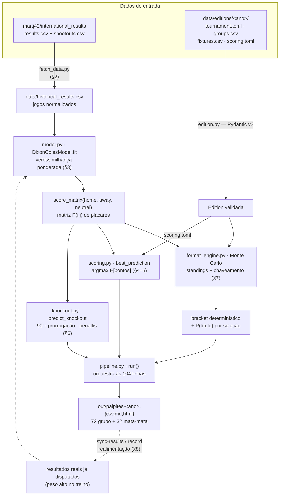

# SPEC — Especificação técnica e metodologia

Documento de **metodologia e decisões** do gerador de palpites (`worldcup`). Cobre a matemática do
modelo, a fórmula de pontuação, a estratégia de escolha do palpite, a simulação e os contratos de
dados — com derivações e exemplos numéricos. Para *como rodar*, veja `README.md`; para *onde está
cada coisa*, veja `AGENTS.md`.

> Notação: `λ` = gols esperados do mandante, `μ` = gols esperados do visitante, `p` = probabilidade.
> Todos os exemplos numéricos são conferíveis à mão e refletem a implementação em `src/worldcup/`.

---

## Visão geral do fluxo

Do dado bruto ao palpite pronto para copiar no app. Cada caixa é um módulo de `src/worldcup/`;
as seções entre parênteses detalham a etapa.



**Realimentação (linha tracejada):** durante a Copa, `sync-results` baixa os placares reais e os
reinjeta no treino (peso alto) e no chaveamento (fixa o que já foi decidido); só os jogos que faltam
são repalpitados. Ver §8.

---

## 1. Objetivo e premissas

Gerar, para cada jogo de uma Copa, o palpite que **maximiza os pontos esperados** no bolão do app
*Bolão de Futebol 2026*, sob o **Sistema I** (probabilístico): os pontos de um jogo crescem com a
**raridade** do resultado — acertar a zebra vale muito mais que cravar o favorito óbvio.

Premissas de projeto:
- **Agnóstico à edição**: formato, jogos e pontuação vivem em dados (`data/editions/<ano>/`).
- **Puramente estatístico**: sem LLM em runtime; só resultados históricos.
- **Reprodutível**: simulações com semente fixa; ajuste determinístico.

---

## 2. Dados

**Fonte**: dataset público `martj42/international_results` (`results.csv` + `shootouts.csv`),
resultados de seleções desde 1872, atualizado poucas horas após cada jogo. Escolhido em vez da
página da FIFA porque esta é renderizada em JavaScript (raspagem frágil); o CSV é estável,
parseável e mantém **histórico e resultados na mesma origem**.

**Normalização** (`fetch_data.py`):
- corte temporal: jogos a partir de `2006-01-01` (configurável);
- só jogos disputados (descarta linhas com placar `NA` — inclusive os jogos futuros de 2026);
- nomes de seleção canonizados para o padrão do dataset (inglês), via `teams.canonical`;
- flag `neutral` booleana (define mando — ver §3.1).

A fonte já traz os 72 jogos de grupo de 2026 (com data, sede e `neutral`); o `fixtures.csv` é
derivado dela seguindo a **escala oficial** da FIFA — cuja ordem `home`/`away` pode listar o
anfitrião como *visitante* num jogo no estádio dele (§3.1). Por isso a ordem passa por conferência,
não é cópia crua. Os jogos de mata-mata de 2026 ainda não têm seleções, então seu chaveamento é
codificado por slots (§7.2).

---

## 3. Modelo Dixon–Coles

### 3.1 Formulação

Para um jogo entre mandante `h` e visitante `a`, os gols `(X, Y)` seguem Poisson com médias

```
λ = exp( base + ataque[h] − defesa[a] + γ · mando_h )
μ = exp( base + ataque[a] − defesa[h] + γ · mando_a )
```

onde `γ` é a vantagem de mando e `base` é o intercepto (nível médio de gols em escala log).

O mando vale `1` para o lado que joga em casa e `0` para o outro; em campo neutro ambos são `0`.
Normalmente quem joga em casa é o mandante (`mando_h = 1`). **Exceção** — a escala oficial da FIFA
às vezes lista o anfitrião como *visitante* num jogo disputado no estádio dele (ex.: Copa 2026,
*Suíça × Canadá* em Vancouver). Nesse caso a vantagem vai para o visitante (`mando_a = 1`): a regra é
"o mando é de quem está em `tournament.toml::hosts`", não da coluna `home`. No código isso é o
parâmetro `host_away` de `score_matrix`, derivado em um único lugar (`MatrixCache._host_away`). No
**ajuste histórico** `host_away` é sempre `False` (o `neutral` da fonte já codifica o mando); o
**backtest** roteia pela mesma `MatrixCache`, com os anfitriões da Copa-alvo (`_WORLD_CUP_HOSTS`),
para pontuar os jogos do país-sede como a produção faria (§9.1).

O modelo **Poisson independente** daria `P(X=i, Y=j) = Pois(i;λ)·Pois(j;μ)`. Dixon & Coles (1997)
mostraram que placares baixos têm **dependência** (empates 0–0/1–1 mais frequentes que o produto
sugere). Corrigem com um fator `τ` aplicado às quatro células baixas:

```
τ(0,0) = 1 − λ·μ·ρ      τ(0,1) = 1 + λ·ρ
τ(1,0) = 1 + μ·ρ        τ(1,1) = 1 − ρ
τ(i,j) = 1              para os demais
```

A probabilidade (não normalizada) de um placar é então

```
P̃(i,j) = τ(i,j; λ, μ, ρ) · Pois(i;λ) · Pois(j;μ)
```

e a matriz é normalizada (§3.4) para somar 1 sobre a grade `0..max_goals`.

### 3.2 Verossimilhança ponderada

Cada jogo `k` contribui com a log-verossimilhança (constantes de fatorial omitidas, pois não afetam
o ótimo):

```
ℓ_k = ln τ(i_k, j_k) + [ i_k·ln λ_k − λ_k ] + [ j_k·ln μ_k − μ_k ]
```

O objetivo é a soma **ponderada** menos uma regularização (ridge):

```
minimizar   − Σ_k  w_k · ℓ_k   +   ridge · ( Σ ataque² + Σ defesa² )
```

com peso `w_k = decaimento_k · torneio_k · multiplicador_k`:

- **Decaimento temporal**: `decaimento = 0.5^(idade_anos / meia_vida)`, meia-vida padrão **2,5 anos**.
  Um jogo de 2,5 anos atrás pesa metade; de 5 anos, um quarto.
- **Importância do torneio**: Copa = 1,0; eliminatórias/continentais ≈ 0,8–0,85; amistoso = 0,5
  (`model.tournament_weight`).
- **Multiplicador** (realimentação): jogos já disputados da própria Copa entram com peso extra
  (`CURRENT_EDITION_BOOST = 6.0`) para reajustar as forças à forma real no torneio.

A **regularização** funciona como **prior fraco**: puxa ataque/defesa para 0 (média da liga). Para
seleções com poucos jogos isso evita estimativas absurdas (regressão à média) — o efeito dos
estreantes.

### 3.3 Identificabilidade

`λ` depende de `ataque[h] − defesa[a]`, invariante sob `ataque → ataque + c`, `defesa → defesa + c`.
O ridge ancora `c` (penaliza valores grandes); pós-otimização **centramos** `ataque` e `defesa` em
média zero e dobramos a constante no `base`. Também filtramos seleções não-FIFA (CONIFA, ilhas) que
jogam circuitos isolados e distorceriam o ajuste: mantém-se só quem disputa competições oficiais
(`peso_torneio ≥ 0.75` ou eliminatórias) com no mínimo `min_matches` jogos.

### 3.4 Exemplo numérico — matriz de placares

Sejam `λ = 1.8`, `μ = 0.8`, `ρ = −0.05`. As Poisson:

```
Pois(0;1.8)=0.1653  Pois(1;1.8)=0.2975  Pois(2;1.8)=0.2678
Pois(0;0.8)=0.4493  Pois(1;0.8)=0.3595  Pois(2;0.8)=0.1438
```

Algumas células (produto × τ):

```
P̃(1,0) = 0.2975·0.4493 · (1 + 0.8·(−0.05)=0.96)  = 0.13369·0.96 = 0.12834
P̃(0,0) = 0.1653·0.4493 · (1 − 1.8·0.8·(−0.05)=1.072) = 0.07428·1.072 = 0.07963
P̃(1,1) = 0.2975·0.3595 · (1 − (−0.05)=1.05)       = 0.10696·1.05 = 0.11231
P̃(0,1) = 0.1653·0.3595 · (1 + 1.8·(−0.05)=0.91)    = 0.05943·0.91 = 0.05408
```

Repetindo para toda a grade `0..10` e normalizando obtém-se a matriz `P`. Daí as probabilidades de
resultado:

```
P(mandante) = Σ_{i>j} P(i,j)   P(empate) = Σ_i P(i,i)   P(visitante) = Σ_{i<j} P(i,j)
```

(`scoring.outcome_probs_from_matrix` faz isso via `tril/trace/triu`.)

---

## 4. Pontuação (Sistema I)

Valores oficiais do app (confirmados no print de regras do grupo):

| Componente | Pontos |
|---|---|
| **Base** (por acertar o resultado 1×2) | **1 a 13**, varia com a probabilidade |
| Placar exato | +5 |
| Placar do vencedor (gols do vencedor) | +3 |
| Diferença de gols (saldo) | +2 |
| Gols do perdedor | +1 |
| Goleada (margem ≥ 3) | +1 |
| Prorrogação (mata-mata) | +3 |
| Pênaltis (mata-mata) | +3 |

Os bônus são **cumulativos** e só contam se o **resultado (1×2) estiver certo** (errou o lado → 0).

### 4.1 Pontos base e o nível de risco

A base traduz "varia com a probabilidade, 1 a 13" como função da probabilidade `p` do resultado que
de fato aconteceu:

```
base(p) = clip( (1/p)^γ , base_min=1 , base_max=13 ),   com γ = 2 · risk
```

- `risk = 0.5 → γ = 1`: `base = 1/p` (fiel ao "1 a 13"; teto 13 atingido em `p ≈ 1/13 ≈ 7.7%`).
- `risk = 0 → γ = 0`: `base = 1` sempre → ignora raridade, tende ao placar mais provável (conservador).
- `risk = 1 → γ = 2`: `base = (1/p)²` → amplia a zebra (agressivo).

Tabela de `base(p)`:

| p | γ=0 (risk 0) | γ=1 (risk 0.5) | γ=2 (risk 1) |
|---|---|---|---|
| 0.70 | 1.0 | 1.43 | 2.04 |
| 0.50 | 1.0 | 2.00 | 4.00 |
| 0.20 | 1.0 | 5.00 | 13.0 (cap) |
| 0.10 | 1.0 | 10.0 | 13.0 (cap) |

### 4.2 Função de pontos

Para palpite `(p_h, p_a)` e resultado real `(r_h, r_a)` com probabilidades de resultado `probs`:

```
se resultado(palpite) ≠ resultado(real):  0
senão:
    pts = base( p_do_resultado_real )
    se placar exato:                       pts += 5
    se saldo igual (vale p/ empate):       pts += 2
    se jogo decidido:
        se acertou gols do vencedor:       pts += 3
        se acertou gols do perdedor:       pts += 1
        se exato e |saldo| ≥ 3:            pts += 1   (goleada)
```

### 4.3 Exemplos numéricos

**Zebra cravada** (vitória do visitante, `p = 0.63`), palpite `0×1`, real `0×1`, `risk = 0.5`:

```
base = 1/0.63 = 1.587
+ exato 5  + saldo 2  + gols do vencedor 3 (Arg fez 1, previu 1)  + gols do perdedor 1
= 1.587 + 11 = 12.59 pts
```

**Favorito cravado** (`p = 0.81`), palpite `2×0`, real `2×0`:

```
base = 1/0.81 = 1.235  + 5 + 2 + 3 + 1 = 12.23 pts
```

**Por que a zebra vale mais**: acertar **exato** um resultado de `p = 0.10` rende
`10 + 5 + 2 + 3 + 1 = 21 pts`, contra ~12 do favorito — embora aconteça menos vezes (ver §5, o
trade-off é resolvido pela maximização do valor esperado).

---

## 5. Escolha do palpite (maximização de pontos esperados)

Dado a matriz `P` do jogo, o valor esperado de um palpite `s = (p_h, p_a)` é

```
E[pts(s)] = Σ_{i,j} P(i,j) · pontos( s, (i,j), probs )
```

e escolhe-se `s* = argmax_s E[pts(s)]` sobre a grade `0..max_goals` (padrão 6). Reportamos também o
**placar mais provável** (`argmax P(i,j)`) como referência, e marcamos `is_upset` quando o resultado
do palpite difere do favorito do modelo.

**Exemplo de trade-off.** Jogo com `probs = (favorito 0.55, empate 0.25, zebra 0.20)`, `risk = 0.5`.
Comparando dois palpites extremos pelo valor esperado (apenas o termo base, para intuição):

- Apostar no favorito: ganha base quando o favorito vence (prob 0.55), `base ≈ 1/0.55 = 1.82` →
  contribuição ~`0.55·1.82 = 1.00` + bônus por exatidão.
- Apostar na zebra: ganha quando a zebra vence (prob 0.20), `base = 1/0.20 = 5.0` →
  contribuição ~`0.20·5.0 = 1.00` + bônus.

As contribuições base se aproximam (é o desenho do Sistema I: `p · (1/p) = 1`), e o desempate vem
dos **bônus de exatidão**, que favorecem o resultado cuja distribuição de placares é mais concentrada.
Subir o `risk` (γ>1) quebra esse equilíbrio a favor da zebra — por isso `risk` alto arrisca mais.

---

## 6. Mata-mata (3 camadas)

Cada jogo eliminatório tem 3 palpites independentes. A partir da matriz e de
`cond_home = P(mandante) / (P(mandante)+P(visitante))` (prob. condicional de vencer um jogo
decidido):

- **Camada 1 — placar dos 90'**: mesmo `best_prediction` da §5 (pode ser empate).
- **Camada 2 — prorrogação**: `mandante` se `cond_home ≥ 0.58`; `visitante` se `cond_home ≤ 0.42`;
  senão `vai aos pênaltis`.
- **Camada 3 — pênaltis**: o lado com `cond_home ≥ 0.5` (quase moeda, leve vantagem ao mais forte).

**Quem avança** (para montar o chaveamento):

```
P(mandante avança) = P(mandante) + P(empate) · cond_home
```

**Exemplo.** `probs = (0.55, 0.25, 0.20)` → `cond_home = 0.55/0.75 = 0.733`.
`P(avança) = 0.55 + 0.25·0.733 = 0.733` → prorrogação **mandante**, pênaltis **mandante**, avança o
mandante. Já `probs = (0.40, 0.30, 0.30)` → `cond_home = 0.571` → camada 2 = **vai aos pênaltis**.

---

## 7. Simulação e chaveamento (`format_engine.py`)

### 7.1 Monte Carlo

Cada simulação (padrão 5000, semente fixa):
1. amostra um placar de cada jogo de grupo a partir da matriz (via CDF + `searchsorted`);
   jogos já disputados usam o placar real;
2. calcula a classificação de cada grupo: **pontos → saldo → gols pró → sorteio determinístico**
   (`tiebreakers` da spec; confronto direto e fair-play oficiais são simplificados para sorteio);
3. pega os 2 primeiros de cada grupo + os **8 melhores terceiros** (ordenados por pontos, saldo,
   gols pró);
4. aloca os terceiros aos slots (§7.3) e simula o mata-mata (amostra placares; empate → moeda
   enviesada por `cond_home`);
5. tabula campeão, classificados, etc.

Saída: probabilidades de **título** e de **classificação** — exemplo de uma execução: Argentina
~32%, Brasil ~20%, Colômbia ~12% (muda com os dados).

### 7.2 Gramática de slots (chaveamento em `fixtures.csv`)

O bracket é orientado a dados: as colunas `home`/`away` de um jogo de mata-mata usam slots:

| Slot | Significado |
|---|---|
| `1A`, `2A` | 1º / 2º colocado do grupo A |
| `3rd` | um melhor-terceiro (com `third_groups` = grupos permitidos) |
| `W73` | vencedor do jogo 73 |
| `L101` | perdedor do jogo 101 (disputa de 3º) |

Isso torna o motor independente do formato: outro número de grupos, com/sem terceiros, ou o formato
antigo de 32 seleções, são apenas dados diferentes.

> **Atenção**: o `match_id` (e os slots `W##`/`L##` que o referenciam) é a numeração **interna** do
> `fixtures.csv`, **não** o número oficial de jogo da FIFA. Em 2026 elas não coincidem (ex.: o jogo
> `50` daqui é o *Match 51* da FIFA; `60` ↔ *Match 59*). Ao cruzar com a escala oficial — para
> conferir `home`/`away` ou um chaveamento — confie nos **nomes das seleções**, não no número.

### 7.3 Alocação dos 8 melhores terceiros

Cada um dos 8 slots de terceiro (jogos 74, 77, 79, 80, 81, 82, 85, 87 em 2026) admite terceiros de
**5 grupos específicos** (FIFA, Annex C). Dado o conjunto dos 8 grupos cujos terceiros se
classificaram, fazemos um **casamento perfeito** slot→grupo respeitando as restrições, via
backtracking (`_assign_thirds`). É um emparelhamento bipartido com 8 itens — barato e determinístico.
Aproxima a tabela oficial de 495 combinações pela via das restrições por slot (ver §9).

### 7.4 Chaveamento determinístico (o palpite concreto)

Para produzir **um** bracket palpitável: pega-se o 1º/2º/3º **mais frequente** de cada grupo (das
contagens do Monte Carlo), os 8 terceiros mais frequentes, e resolve-se cada jogo na ordem usando
`P(avança) ≥ 0.5`. Resultados reais já registrados têm prioridade sobre a previsão.

---

## 8. Realimentação durante a Copa

Dois caminhos preenchem `home_goals/away_goals` (e `ko_outcome`) em `fixtures.csv`:

- **`sync-results`** (`sync.py`): baixa os placares reais da fonte; preenche a fase de grupos por par
  de seleções; resolve o mata-mata **só com resultados reais** (standings reais → slots → vencedores,
  com pênaltis via `shootouts.csv`) e preenche cada confronto resolvido.
- **`record`**: ajuste manual de um jogo (com `--ko-winner` para empate em mata-mata).

No `predict` seguinte: os jogos disputados (a) entram no treino com peso alto (§3.2), (b) **fixam** a
classificação/chaveamento reais em vez de simular, e (c) saem como `FINAL`; só os jogos restantes
recebem palpite.

---

## 9. Validação (backtest) e limitações

### 9.1 Backtest

`backtest.py` treina **só com jogos anteriores** ao início da Copa-alvo e palpita todos os jogos
daquela Copa, somando os pontos do Sistema I. A **seleção** do placar usa o `risk` testado, mas os
pontos são **concedidos sempre pela fórmula fiel** (`risk = 0.5`), como o app faria — assim a
comparação entre estratégias é justa. As matrizes passam pela mesma `MatrixCache` da produção, com
os anfitriões da Copa-alvo (`_WORLD_CUP_HOSTS`), para tratar o mando do país-sede de forma idêntica
(§3.1). Em 2022 isso não altera a tabela: o Qatar abriu como mandante, então o caso *host-away*
nunca dispara.

Resultado na Copa **2022** (64 jogos):

| risco | pts totais | média/jogo | % resultado | % placar exato |
|---|---|---|---|---|
| 0.0 / 0.5 | 140.5 | 2.20 | 42.2% | 9.4% |
| 1.0 | **207.4** | 3.24 | 43.8% | **17.2%** |

A estratégia agressiva fez ~47% mais pontos numa Copa cheia de zebras — coerente com "azarão vale
mais". (Uma Copa só; não generalizar cegamente.)

### 9.2 Limitações conhecidas

- **Modelo baseado em resultados**: pondera fortemente o recente → favorece quem vem bem (CONMEBOL
  aparece forte) e pode subestimar potência em má fase recente (ex.: França).
- **Desempates de grupo** simplificados (sem confronto direto / fair-play oficiais).
- **Terceiros**: casamento por restrição aproxima o Annex C; após a fase de grupos, confira os 8
  confrontos dos 32-avos com os resultados reais registrados.
- **Mata-mata em camadas**: o placar real importado pode incluir prorrogação (não só 90'); para a
  realimentação isso é irrelevante (interessa o vencedor e o efeito no treino).

### 9.3 Ideias futuras

- Ingerir **odds reais** (120+ casas) para apostar em "valor" onde o modelo discorda do mercado.
- Estratégia explícita de **ganhar o bolão** (variância/contrarianismo em função da posição no
  ranking), além de maximizar pontos esperados.
- Confronto direto oficial nos desempates; tabela Annex C completa.

---

## Referências

- M. J. Dixon, S. G. Coles (1997). *Modelling Association Football Scores and Inefficiencies in the
  Football Betting Market*. Applied Statistics 46(2).
- Dataset: `github.com/martj42/international_results`.
